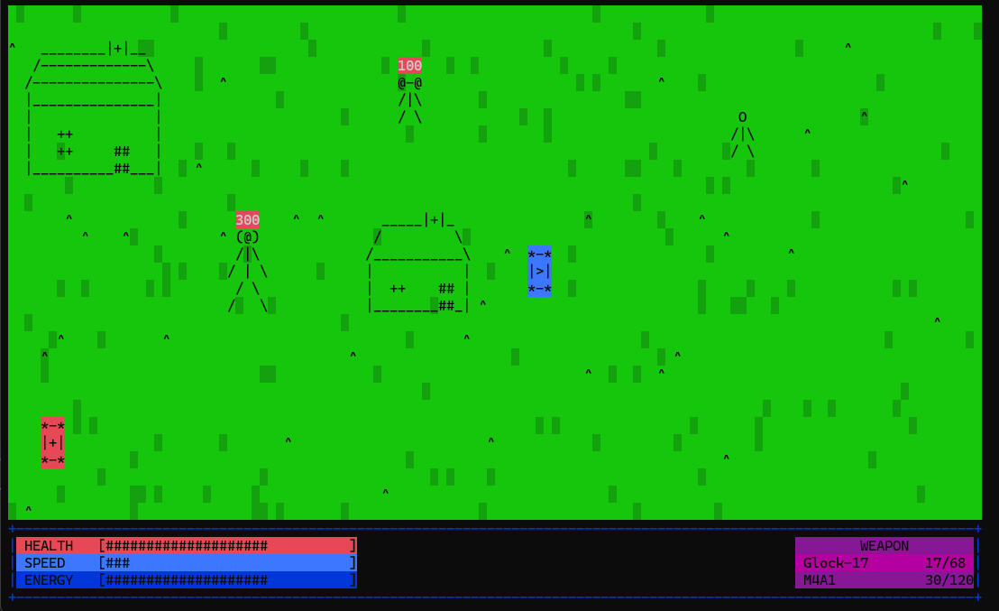

# ASCII Open-World Shooter

This project is a 2D top-down open-world shooter with ASCII-style graphics.  
The game combines free exploration, real-time combat with firearms, enemies, collision-based interactions, and a player status system represented through on-screen bars.

## Gameplay Overview

The player explores an open world rendered entirely using ASCII symbols. The environment includes various structures, open areas, and interactive objects. Movement is unrestricted, allowing the player to freely navigate the map while engaging hostile entities.

## Core Mechanics

### Open World
- Large, freely explorable map
- Static and interactive structures (houses, objects, obstacles)
- No strict level boundaries, encouraging exploration

### Combat System
- Real-time shooting mechanics
- Firearms-based combat
- Multiple weapons available (e.g. Glock-17, M4A1)
- Ammo management with magazine and reserve counts
- Damage indicators displayed above enemies

### Enemies
- Hostile entities placed across the map
- Enemies have health values shown during combat
- Basic AI movement and attack behavior
- Enemies interact with the environment and player via collision

### Collision System
- Collision detection between:
  - Player and environment
  - Player and enemies
  - Bullets and entities
- Prevents movement through walls and solid objects

### Player Status & UI
The game features an in-game HUD displaying:
- **Health bar** — current player health
- **Speed bar** — player movement speed or stamina
- **Energy bar** — resource used for actions or abilities
- **Weapon panel** — currently equipped weapon and ammo count

All bars update dynamically in real time based on player actions.

### Bonuses & Pickups
- Collectible items scattered across the world
- Bonuses may affect:
  - Health
  - Energy
  - Speed
  - Ammo or weapon availability
- Visual indicators for pickups on the map

## Visual Style
- ASCII-based rendering
- Color-coded elements for clarity:
  - Green terrain
  - Highlighted enemies
  - Colored UI panels
- Minimalistic yet information-rich interface

This project serves as both a learning exercise and a foundation for further expansion.